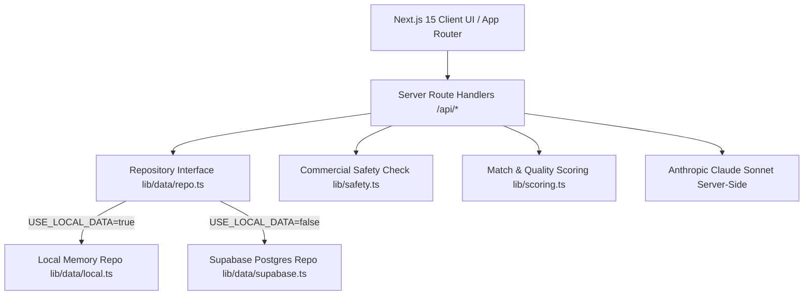

# ReelForge — Production Desk for Hiring AI Creators

ReelForge is a production desk marketplace where commercial brands find and hire AI filmmakers, animators, and generative designers.
It enables brands to inspect step-by-step workflow replays, verify tool subscription licences for commercial safety, and score creator matches against structured campaign briefs.
Built for high-velocity commercial production with zero-setup offline fallback capabilities.

---

## ⚡ 60-Second Demo Path

1. **Brand Brief Creation**: Navigate to `/briefs/new`, click **"Use sample idea"**, and click **"Structure brief with AI"**.
2. **Clearance & Quality Score**: Set aspect ratio to **9:16** and check **paid_ads**. Observe the quality score reach &ge; 85.
3. **Publish Brief & Ranked Matches**: Click **"Publish campaign brief"** to view ranked creators on `/briefs/[id]` with match reasons and safety badges.
4. **Creator Discovery & Filters**: Open `/creators`, filter by **Runway** and **9:16**, and test zero-result filter recovery suggestions.
5. **Workflow Replay**: Open creator `/creators/cr_1` and click any portfolio item to inspect the step-by-step workflow replay log and public proof link.
6. **Engagement Lifecycle**: Invite a creator, switch role to Creator using the top bar, accept the invite, and submit version v1. Switch back to Brand to review and approve.

---

## 🛠️ Local Run Steps

```bash
# 1. Clone repository
git clone https://github.com/reelforge/reelforge.git
cd reelforge

# 2. Install dependencies
npm install

# 3. Start local development server (No API keys required)
npm run dev
# Open http://localhost:3000 in your browser
```

---

## 🏗️ Architecture Diagram



---

## 📊 Data Model Overview

Controlled vocabularies (`lib/vocab.ts`) govern all filtering and match scoring:
- **CONTENT_TYPES**: `video`, `animation`, `image`, `motion_graphics`, `audio_music`, `3d`
- **FORMATS**: `9:16`, `16:9`, `1:1`, `4:5`
- **TOOLS**: `Runway`, `Kling`, `Luma`, `Pika`, `Midjourney`, `Stable Diffusion`, `ComfyUI`, `ElevenLabs`, `After Effects`, `DaVinci Resolve`, `CapCut`
- **LICENSE_STATUS**: `allowed`, `restricted`, `not_allowed`, `unknown`

---

## 📑 Rubric-to-Feature Mapping

| Rubric Criterion | Weight | Feature Implementation | Page Link | Source File |
| :--- | :---: | :--- | :--- | :--- |
| **Creator Profiles & AI Portfolios** | 30 | Profiles with workflow step logs, generation counts, and proof URLs | `/creators/cr_1` | `src/components/creators/CreatorProfile.tsx` |
| **Discovery & Filtering** | 25 | Faceted filtering, search, removable chips, and empty state suggestions | `/creators` | `src/components/creators/CreatorDirectory.tsx` |
| **Brief Definition** | 20 | Structured campaign builder, platform presets, and live quality meter | `/briefs/new` | `src/app/briefs/new/page.tsx` |
| **User Experience** | 15 | Quiet paper production aesthetic, strict typography, accessible HTML | `/` | `src/app/globals.css` |
| **Presentation & Demo** | 10 | Role switcher, revision board lifecycle, `/api/health`, and review mapping | `/review` | `src/app/review/page.tsx` |
| **Bonus Features** | Bonus | Commercial safety check engine, vision style matching, AI brief builder | `/briefs/new` | `src/lib/safety.ts` |

---

## ⚠️ Known Limitations

1. **Licence Data**: Tool license rows in `ToolLicense` are illustrative placeholders for demonstration purposes. Real terms should be checked independently.
2. **Verification Signals**: Verification levels are computed from platform review flags and attached proof URLs, not live third-party OAuth integrations.
3. **AI Routes Fallback**: If `ANTHROPIC_API_KEY` is not present, AI structuring and vision routes seamlessly fall back to pre-configured sample data with a visible notice.

---

## 🧪 Testing Commands

```bash
# Run Vitest unit tests (match scoring, safety clearance, quality meter)
npm test

# Run Playwright end-to-end smoke test
npm run e2e

# Check public seed media manifest status
npm run check:media

# Production build verification
npm run build
```

---

## 📷 Screenshots

Screenshots illustrating key application flows are located in `/docs`:
- `docs/screenshot-home.png` — Production desk home hero & contact sheet
- `docs/screenshot-directory.png` — Creator directory with faceted filters
- `docs/screenshot-profile.png` — Creator profile & workflow replay modal
- `docs/screenshot-brief.png` — Campaign brief definition & live quality meter
